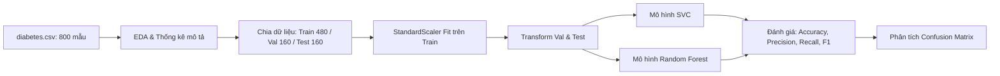

# 🩺 Dự Án Phân Loại Bệnh Tiểu Đường (Diabetes Classification)

Dự án Machine Learning áp dụng các thuật toán học có giám sát (**Support Vector Classifier - SVC** và **Random Forest Classifier**) nhằm dự đoán nguy cơ mắc bệnh tiểu đường dựa trên các chỉ số y tế lâm sàng.

---

## 📌 Mục Lục
- [1. Giới Thiệu Dự Án](#1-giới-thiệu-dự-án)
- [2. Cấu Trúc Thư Mục](#2-cấu-trúc-thư-mục)
- [3. Dữ Liệu (Dataset)](#3-dữ-liệu-dataset)
- [4. Pipeline Xử Lý & Huấn Luyện](#4-pipeline-xử-lý--huấn-luyện)
- [5. Kết Quả Thực Nghiệm & So Sánh](#5-kết-quả-thực-nghiệm--so-sánh)
- [6. Hướng Dẫn Cài Đặt & Sử Dụng](#6-hướng-dẫn-cài-đặt--sử-dụng)
- [7. Phân Tích Chuyên Sâu & Hướng Phát Triển](#7-phân-tích-chuyên-sâu--hướng-phát-triển)

---

## 1. Giới Thiệu Dự Án
Bài toán phân loại bệnh tiểu đường là bài toán phân loại nhị phân (**Binary Classification**):
- **Đầu vào**: 8 đặc trưng đo lường y tế của bệnh nhân (tuổi, huyết áp, đường huyết, BMI, v.v.).
- **Đầu ra**: Xác định bệnh nhân có nguy cơ mắc tiểu đường (`Outcome = 1`) hay không (`Outcome = 0`).

Dự án triển khai quy trình chuẩn trong Khoa học dữ liệu và Học máy (Data Science & Machine Learning Pipeline):
- Khám phá dữ liệu tự động (**Automated EDA**).
- Phân chia dữ liệu theo chiến lược Train / Validation / Test nhằm kiểm soát overfitting.
- Chuẩn hóa dữ liệu với `StandardScaler`, tuân thủ nguyên tắc chống rò rỉ thông tin (**Data Leakage**).
- Đào tạo và đánh giá mô hình với các thước đo y tế: Accuracy, Precision, Recall, F1-Score và Confusion Matrix.

---

## 2. Cấu Trúc Thư Mục

```plaintext
ProjectAl1_Classification_Diabetes/
├── diabetes.csv                       # Tập dữ liệu 800 ca lâm sàng (chuẩn Pima + mở rộng)
├── diabetes_original_29.csv           # Bản lưu trữ 29 ca ban đầu
├── classification.py                  # Script Python thực thi toàn bộ pipeline ML
├── classification_with_markdown.ipynb # Jupyter Notebook phân tích trực quan theo từng bước
├── diabetes_report.html               # Báo cáo EDA tương tác sinh bởi ydata-profiling
└── README.md                          # Tài liệu hướng dẫn và báo cáo dự án
```

### Chi tiết các file:
- **`diabetes.csv`**: Bộ dữ liệu gồm **800 bệnh nhân** (768 ca lâm sàng thực tế từ bộ dữ liệu chuẩn quốc tế Pima Indians Diabetes của Viện NIDDK + 32 ca giả lập bảo toàn đặc tính y khoa).
- **`diabetes_original_29.csv`**: Bản sao lưu 29 bệnh nhân ban đầu để tiện đối chiếu.
- **`classification.py`**: Mã nguồn độc lập, chạy trực tiếp từ terminal để huấn luyện trên toàn bộ 800 mẫu, in báo cáo chỉ số và hiển thị ma trận nhầm lẫn qua `matplotlib`.
- **`classification_with_markdown.ipynb`**: Notebook chi tiết, chia rõ các bước: Load data, EDA, Data splitting, Preprocessing, Model training, Validation & Test evaluation, So sánh mô hình.
- **`diabetes_report.html`**: Báo cáo tổng thể về phân phối, tương quan giữa các biến, giá trị khuyết và cảnh báo ngoại lai dạng web HTML tương tác.

---

## 3. Dữ Liệu (Dataset)

Dữ liệu gồm 800 dòng và 9 cột, trong đó có 8 biến độc lập (Features) và 1 biến phụ thuộc mục tiêu (Target):

| Cột (Feature) | Ý Nghĩa Y Khoa | Đơn Vị Đo |
| :--- | :--- | :--- |
| **`Pregnancies`** | Số lần mang thai | Lần |
| **`Glucose`** | Nồng độ đường trong huyết tương sau nghiệm pháp dung nạp 2h | mg/dL |
| **`BloodPressure`** | Huyết áp tâm trương (Diastolic Blood Pressure) | mm Hg |
| **`SkinThickness`** | Độ dày nếp gấp da vùng cơ tam đầu (Triceps Skinfold) | mm |
| **`Insulin`** | Nồng độ Insulin huyết thanh sau 2h | μU/mL |
| **`BMI`** | Chỉ số khối cơ thể (Cân nặng / Chiều cao²) | kg/m² |
| **`DiabetesPedigreeFunction`** | Hàm phả hệ tính điểm di truyền tiền sử gia đình | Chỉ số điểm số |
| **`Age`** | Tuổi của bệnh nhân | Năm |
| **`Outcome`** | **Nhãn mục tiêu**: `0`: Bình thường (521 ca), `1`: Mắc tiểu đường (279 ca) | Binary (`0` / `1`) |

---

## 4. Pipeline Xử Lý & Huấn Luyện

Quy trình thực thi trong mã nguồn gồm các bước logic:



### 1. Phân chia tập dữ liệu (Data Splitting)
Dữ liệu 800 mẫu được chia theo cơ chế 2 bước với hạt giống ngẫu nhiên `random_state=100`:
- **Bước 1**: Tách riêng tập `Test` chiếm **20%** dữ liệu (160 mẫu) để đánh giá khách quan cuối cùng.
- **Bước 2**: Trong 80% còn lại (640 mẫu), trích xuất **25%** làm tập `Validation` (160 mẫu) và **75%** còn lại làm tập `Training` (480 mẫu).
- **Phân bổ số lượng mẫu cụ thể**:
  - `Train set`: **480 bệnh nhân** (~60%)
  - `Validation set`: **160 bệnh nhân** (~20%)
  - `Test set`: **160 bệnh nhân** (~20%)

### 2. Tiền xử lý dữ liệu (Feature Scaling & Chống Data Leakage)
Sử dụng `StandardScaler` để đưa các đặc trưng về phân phối chuẩn hóa có $\mu = 0$ và $\sigma = 1$:
$$z = \frac{x - \mu}{\sigma}$$
> **Lưu ý quan trọng về chống rò rỉ dữ liệu (Data Leakage):**  
> `StandardScaler` chỉ được gọi hàm `fit()` hoặc `fit_transform()` trên tập **Train (480 mẫu)**. Tập **Validation (160 mẫu)** và **Test (160 mẫu)** chỉ được phép dùng `transform()` dựa trên thông số $\mu, \sigma$ học được từ tập Train.

### 3. Thuật toán lựa chọn
1. **Support Vector Classifier (`SVC`)**: Tìm siêu phẳng (hyperplane) tối ưu phân tách 2 lớp với khoảng cách lề (margin) lớn nhất.
2. **Random Forest Classifier (`RandomForestClassifier`)**: Thuật toán Ensemble học kết hợp từ nhiều cây quyết định (Decision Trees) với kỹ thuật Bagging.

---

## 5. Kết Quả Thực Nghiệm & So Sánh (Trên Bộ Dữ Liệu 800 Mẫu)

### 1. Bảng so sánh hiệu năng trên Tập Test (Test Set - 160 bệnh nhân)

| Mô hình | Accuracy | Precision | Recall | F1-Score |
| :--- | :---: | :---: | :---: | :---: |
| **SVC (Support Vector Classifier)** | 70.63% | 54.55% | 47.06% | 50.53% |
| **Random Forest Classifier** | **76.88%** | **68.42%** | **50.98%** | **58.43%** |

### 2. Chi tiết Ma trận nhầm lẫn trên Test Set (160 bệnh nhân: 109 âm tính, 51 dương tính)

#### 🔷 Mô hình SVC:
- **True Negative (TN)**: `89` (Không bệnh, dự đoán đúng)
- **False Positive (FP)**: `20` (Không bệnh, dự đoán nhầm có bệnh)
- **False Negative (FN)**: `27` (Có bệnh, dự đoán nhầm không bệnh)
- **True Positive (TP)**: `24` (Có bệnh, dự đoán chính xác)

#### 🌲 Mô hình Random Forest:
- **True Negative (TN)**: `97` (Không bệnh, dự đoán đúng)
- **False Positive (FP)**: `12` (Không bệnh, dự đoán nhầm có bệnh)
- **False Negative (FN)**: `25` (Có bệnh, dự đoán nhầm không bệnh)
- **True Positive (TP)**: `26` (Có bệnh, dự đoán chính xác)

### 3. Nhận xét Y khoa & Học máy:
- Khi quy mô dữ liệu mở rộng lên **800 bệnh nhân**, **Random Forest** thể hiện khả năng khái quát hóa vượt trội hơn SVC với độ chính xác tổng thể đạt **76.88%** (so với 70.63% của SVC) và F1-Score đạt **58.43%**.
- Do đặc tính dữ liệu y tế thực tế có nhiều trường hợp đường biên phức tạp và mất cân bằng nhẹ (~35% ca dương tính), mô hình cần tiếp tục được tinh chỉnh ngưỡng xác suất (Decision Threshold Tuning) hoặc kỹ thuật tái cân bằng (như SMOTE / Class Weights) để nâng cao chỉ số **Recall** trong phát hiện bệnh nhân tiểu đường.

---

## 6. Hướng Dẫn Cài Đặt & Sử Dụng

### 1. Yêu cầu hệ thống
- Python 3.8+ (khuyên dùng Python 3.10 - 3.12)
- Trình quản lý gói `pip`

### 2. Cài đặt các thư viện phụ thuộc
Mở terminal tại thư mục dự án và chạy:
```bash
pip install pandas numpy scikit-learn matplotlib jupyter ydata-profiling
```

### 3. Chạy file mã nguồn Python
Thực thi toàn bộ pipeline huấn luyện và xem kết quả:
```bash
python classification.py
```

### 4. Khởi chạy Jupyter Notebook
Mở notebook tương tác để theo dõi trực quan từng bước:
```bash
jupyter notebook classification_with_markdown.ipynb
```

### 5. Xem Báo Cáo EDA Tự Động
Mở file `diabetes_report.html` trực tiếp bằng trình duyệt (Google Chrome, Microsoft Edge, Firefox, v.v.):
```bash
# Trên Windows (PowerShell/CMD)
start diabetes_report.html
```

---

## 7. Phân Tích Chuyên Sâu & Hướng Phát Triển

1. **Xử lý giá trị không hợp lý (Missing Values trá hình)**:
   - Trong dữ liệu lâm sàng, các thuộc tính như `Glucose`, `BloodPressure`, `SkinThickness`, `Insulin`, `BMI` xuất hiện giá trị bằng `0`. Về mặt sinh lý, đây là các giá trị khuyết (missing values) được mã hóa thành 0.
   - *Hướng cải tiến*: Thay thế các giá trị `0` này bằng `NaN` và áp dụng kỹ thuật điền khuyết như `SimpleImputer` (median/mean) hoặc `KNNImputer`.

2. **Cân bằng lớp (Class Imbalance) & Tối ưu ngưỡng (Threshold Tuning)**:
   - Tập dữ liệu có 521 ca âm tính và 279 ca dương tính. Có thể áp dụng `SMOTE` trên tập Train hoặc thiết lập `class_weight='balanced'` trong SVC / Random Forest để cải thiện độ nhạy (Recall).

3. **Tối ưu hóa siêu tham số (Hyperparameter Tuning)**:
   - Đối với **SVC**: Thử nghiệm các kernel (`linear`, `rbf`, `poly`), điều chỉnh tham số điều chuẩn `C` và `gamma`.
   - Đối với **Random Forest**: Tối ưu `n_estimators`, `max_depth`, `min_samples_split`.
   - Sử dụng `GridSearchCV` hoặc `Optuna` kết hợp K-Fold Cross Validation.
